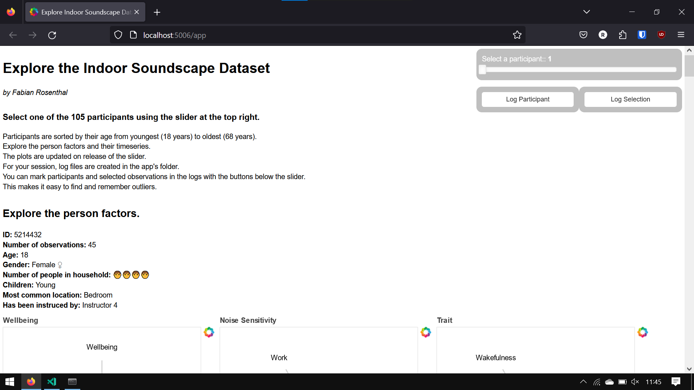

# Data Visualization for Indoor Soundscape Dataset

Author: Fabian Rosenthal

This repo creates an interactive data visualization app using bokeh for python. It builds on the study dataset by Versümer, Steffens and Rosenthal (2023): See [researchgate](https://www.researchgate.net/publication/369062819_Extensive_crowdsourced_dataset_of_in-situ_evaluated_binaural_soundscapes_of_private_dwellings_containing_subjective_sound-related_and_situational_ratings_along_with_person_factors_to_study_time-varyin) and [Zenodo](10.5281/zenodo.7858848).
The app make the large crowdsourced dataset accessible and explorable from the perspective of the participants. It allows to explore the subjective ratings in a more intuitive way than with traditional statistical methods and get a better understanding of the diversity of the data.

This contribution was developed as a project for the Data Visualization course with Konrad Förstner at University of Applied Sciences Cologne.

# Getting started

In this README you learn how to run the app locally using a bokeh server from the command line.

### Prerequisites

This program was developed and tested on Windows 10 with Python 3.11.3 and bokeh 3.1.1. Other version might as well work but are not guaranteed to do so.
First, clone the repo to your local machine. Then open a new command line and navigate to the directory e.g. using `cd path\to\this\repository`.
Make sure to install the requirements from the `requirements.txt` file for example using `pip install -r path\to\requirements.txt` from the command line.

### Starting the app

To run this app locally, you need to start a bokeh server from the command line.
If you are using a virtual environment, make sure to activate it before running the server.
For example, if you are using conda, you can activate the environment using `conda activate name_of_the_environment`.
Now we're ready to start the bokeh server by running the following command:

```bash
bokeh serve --show app.py
```

Your command line should output something like this

```bash
`Starting Bokeh server version 3.1.1 (running on Tornado 6.2)
2023-07-02 06:07:48,262 User authentication hooks NOT provided (default user enabled)
2023-07-02 06:07:48,278 Bokeh app running at: http://localhost:5006/main
2023-07-02 06:07:48,278 Starting Bokeh server with process id: 17576
2023-07-02 06:07:52,951 WebSocket connection opened
2023-07-02 06:07:52,967 ServerConnection created
```

and your browser should now open automatically. If it doesn't, you can simply open a new browser window and go to `localhost:5006/app`.

### Loading and preprocessing

When you first run the app, it loads the dataset from Zenodo and makes preprocessing steps. This may take a second.
To make it start a bit faster the next time, the preprocessed data is pickled and saved in the `data` folder.
If you want to load the data from scratch, delete the `data/data.pickle` file.

### Using the app

###### When your app is ready to explore, you should see the following:



The slider in the top right lets you select the participant. The plots and values will update on release of the slider automatically. We will have a look at the use of the buttons later.selecting the participant you are able to explore

- person factors,
- an activity profile,
- the typical soundscape composition,
- personality traits,
- ratings of the soundscape dimensions
- loudness ratings
- and situational ratings for each participant.

###### Also, you can further explore dataopoints by hovering over the data points with your mouse like so:


Have fun exploring the diverse participantsy and their subjective ratings in the dataset interactively!

### Logging

You have the possibility to mark people or data points that are useful for you. A logfile is created in the background for every session. It is in the `/logs` folder. It will include every slider change, so you have a history of what you looked at. Also you can mark special participants in the log file by using the button `Log Participant`. And when data points are currently selected you can also log the keys corresponding to the data in the original table by using the `Log Selection` button. For the button, outputs we also create a `.csv` file, so you can easily access these logged information and incorporate them in filtering processes working with the data.
